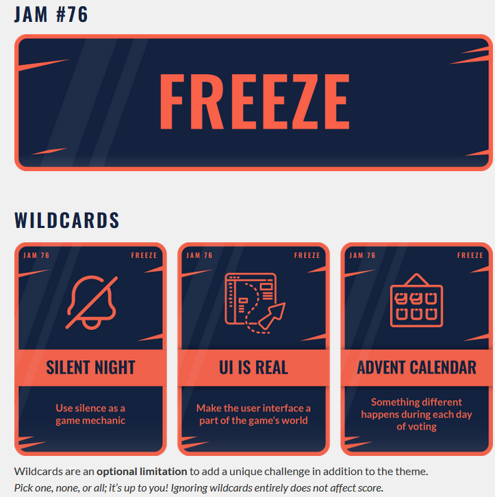

# godot-wild-jam-76-freeze

Godot 4.3 project for Godot Wild Jam #76

The folder structure follows this idea: https://www.reddit.com/r/godot/comments/17j7r9m/comment/k6z8xi5/?utm_source=share&utm_medium=web3x&utm_name=web3xcss&utm_term=1&utm_content=share_button

Several sub folders have their own README.md file which further explain the folder structure.

The source is available under the *GNU GPLv3* license

